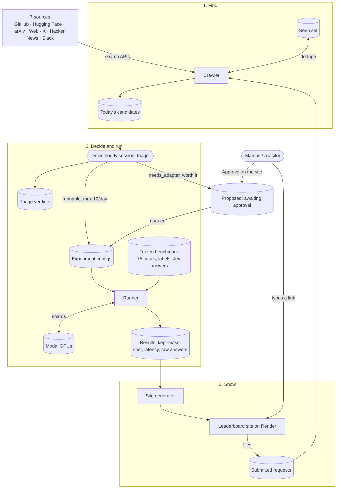
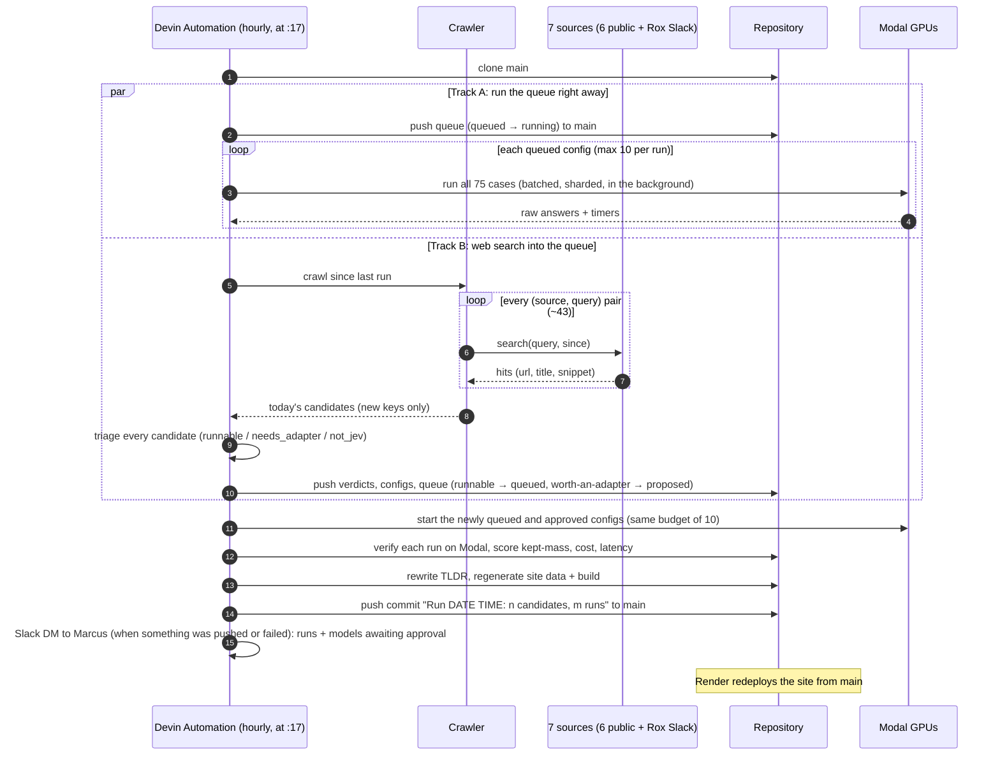
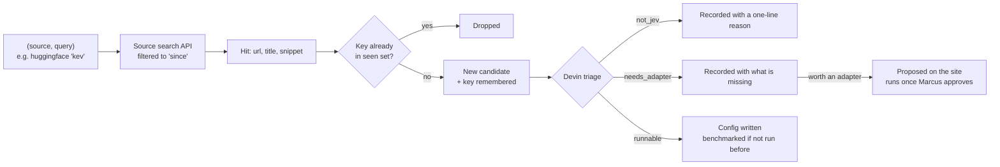

# jev-tracker

Leaderboard of Jev alternatives on Rox's frozen 75-case reranking benchmark. The data lives in
this repository; an hourly automation runs new models on Modal and pushes the numbers to `main`.

- `docs/SPEC.md` — requirements R-1..R-9 and their conformance status
- `docs/PLAN.md` — phases, decisions, next steps
- `docs/PRIOR_WORK.md` — prior-work survey for the crawler (R-8): sources, rate limits, what to copy
- `docs/AUTOMATION.md` — the hourly automation's runbook (R-9): two parallel tracks — run the queue on Modal / web-search into the queue — then regenerate, push to `main`
- `docs/DAILY_RUN.html` — how an automation run works: block diagram, sequence diagram, steps, triage verdicts, guardrails (open in a browser)
- `docs/GGUF_SPEC.html`, `docs/GGUF_PLAN.html`, `docs/GGUF_SPRINT_TASKS.html` — the GGUF task (its own spec, R-1..R-3), plan with block + sequence diagrams, and the four sprint tickets (bodies in `docs/src/gguf_*_body.html`)
- `docs/JEV_ALTERNATIVES.html` — every crawler hit triaged as a real Jev alternative, grouped by what stops it running, one row per distinct model, with filters (open in a browser; rebuild with `python3 docs/src/build_jev_alternatives.py` + the artifact kit)
- `jev_tracker/` — harness: System One contract, methods, kept-mass metric, Modal runner,
  experiment lifecycle (`run` / `status` / `finish` / `costs` / `latency`)
- `configs/` — one YAML per experiment (which models, methods, GPUs, shards)
- `data/benchmark/` — the 75 cases and labels (frozen)
- `data/jev/` — Jev's committed answers
- `data/experiments/<id>/` — config, calls, raw answers (gzipped), kept-mass, costs, latency
- `data/registry.yaml` — row labels (model family, serving, runtime, GPU) for every reranker shown;
  a row with `deprecated: <reason>` never reaches the site, nor does one with `pending_fanout: <reason>`
  (a valid row hidden until its fan-out latency run lands); `latency_from: {experiment, reranker}`
  takes the row's latency (and its `sources.latency` link) from another experiment's
  `latency_<id>.json` — used for fan-out latency runs, whose quality and cost come from the
  row's own experiment
- `site/` — Vite + React static site: summary / quality / cost / latency tables, filters,
  "Suggest a model to scrape" form in the left panel; `site/public/data/rows.json` is generated, `site/dist/` is the build
- `crawler/` — R-8: finds new Jev / Kev / Laya / decision-model mentions (GitHub, Hugging Face,
  arXiv, web, X/Twitter, Hacker News, Rox's Slack); `crawler/queries.yaml`, `crawler/seen.jsonl`,
  `crawler/candidates/<date>.jsonl`

## How it works

Three parts share one repository: the **benchmark harness** scores a model on the 75 frozen cases,
the **hourly run** finds and benchmarks new models, and the **site** shows the results.

**Figure 1. Block diagram of the system.**



Legend: rectangles are processes, cylinders are data committed to the repo (or Modal storage),
the hexagon is the one step where an LLM (Devin) makes a judgment call, the rounded box is a person.
Everything Devin changes is pushed straight to `main` as fast-forward commits, so the site
redeploys without a merge (the evaluation-queue file is pushed first, so the site shows what is
running, and Marcus's Approve / Skip clicks on the site land there immediately; a Running card draws each shard's tqdm bar — requests done / total,
elapsed < ETA, rate — which the Modal workers publish while they run). Models the harness cannot call yet are *proposed*, not run: the
site lists them under "Awaiting your approval" and only an approved one is built and benchmarked.

**Figure 2. One hourly run, as a sequence diagram.**



Legend: solid arrows are calls, dashed arrows are replies, boxes marked `loop` repeat, the `par`
box holds the two tracks that run at the same time. Steps 2–4 are Track A (the runs), steps 5–10
are Track B (crawl and triage), steps 11–16 are the join.

**Figure 3. What happens to one search hit.**



Legend: diamonds are decisions. The key is the URL, except Hugging Face models, where it is
`hf:<id>@<commit>`, so new weights under an old model id come back once more.

**Table 1. What each source is asked.**

| Source | API | What a query matches | Date filter |
|---|---|---|---|
| GitHub | repository search | name, description, readme; repo pushed since the window | server-side |
| Hugging Face | model search, newest first | model id substring | client-side, last modified |
| arXiv | Atom API, all fields | title / abstract / authors; terms ANDed | client-side, last updated |
| Web | Tavily (keyless) | any page | whole days back |
| X / Twitter | Tavily + `site:x.com` | posts on x.com / twitter.com | whole days back |
| Hacker News | Algolia | stories and comments; quoted phrases only | server-side |
| Slack | Rox workspace via the Slack MCP search the hourly Devin session runs (results handed to the crawler) | messages in channels and DMs Marcus can see | server-side (`after:`) |
| Submitted | the site's text box | whatever a person typed | none |

Queries live in `crawler/queries.yaml`: the model names (`jev`, `kev`, `laya`, `systemone`,
`"system one"`, `noul`, `"decision model" reranker`, `jaredpalmer/kev`) per source. The crawler
only collects; it never decides relevance. Relevance is the triage step.

**Table 2. Triage verdicts.**

| Verdict | Meaning | What happens |
|---|---|---|
| `runnable` | a model the harness can already call (Kev-family or official Laya weights on Hugging Face, or a hosted API whose key is a Modal Secret); also used for posts about such a model | config in `configs/`; benchmarked if that exact model/revision has no results yet |
| `needs_adapter` | a real Jev alternative the harness cannot call yet (GGUF/ONNX/MLX export, own architecture or serving stack, key not provisioned, over budget) | recorded with what is missing; nothing runs |
| `not_jev` | unrelated hit (a person called Kev, CISA KEV, keV in physics, apps built on Jev) | recorded with a one-line reason |

### Reading what the crawl found

- `crawler/candidates/<date>.jsonl`: every new hit that day (source, url, title, snippet, query).
- `crawler/triage/<date>.yaml`: Devin's verdict and reason for each of them, matched by `key`.
- `data/experiments/<id>/`: results for the models that ran; `data/tldr.md` is the day's summary.

```bash
uv run python -m crawler.triage check crawler/triage/<date>.yaml crawler/candidates/<date>.jsonl  # counts per verdict
python3 -c "import yaml,sys;[print(d['key'],'|',d['reason']) for d in yaml.safe_load(open(sys.argv[1])) if d['verdict']=='needs_adapter']" crawler/triage/<date>.yaml
```

The fuller explainer (same diagrams, step table, guardrails) is `docs/DAILY_RUN.html`.

## Run

```bash
uv sync
export MODAL_TOKEN_ID=... MODAL_TOKEN_SECRET=...   # Modal workspace rox-research
uv run python -m jev_tracker.experiment run configs/kev4b_smoke.yaml   # 2 cases, ~$0.05
uv run python -m jev_tracker.experiment status <id>
uv run python -m jev_tracker.experiment finish <id>                    # pull raws, score, cost, latency
uv run pytest                                                          # offline tests
```

## Site

```bash
uv run python -m jev_tracker.site_data     # registry.yaml + data/experiments -> site/public/data/rows.json
cd site && npm ci && npm run build          # -> site/dist (committed)
GITHUB_TOKEN=<PAT> QUEUE_SKIP_PASSWORD=<pw> uv run python -m jev_tracker.server   # http://localhost:8000, accepts form submissions
python3 -m http.server -d site/dist 8000                 # read-only alternative (no submissions)
docker build -t jev-tracker . && docker run -p 8000:8000 -e GITHUB_TOKEN=<PAT> -e QUEUE_SKIP_PASSWORD=<pw> jev-tracker  # what Render runs
```

Cost and latency are like-for-like across rows. Cost = the shards' own warm seconds (loaded server
to last answer, at the run's full load — `concurrency` requests in flight per GPU, 16 by default)
summed over every GPU shard, billed at Modal's GPU $/s plus reserved host RAM $/GiB/s; failed calls
count $0, CPU and egress are ignored, and the site shows one number, $ per 1k queries (run cost
x 1000 / queries). Latency = per-query wall clock (first request sent to last answer back), shown
as mean / median / p95 across queries — the same definition as the prod / Jev API timing in
`data/timing_summary_prod_jev.csv`.

Every number on the page links to the JSON it came from. The summary tab opens with the last-updated
time, headline cards and a TLDR the hourly run writes to `data/tldr.md`. The left panel's "Suggest a model to scrape" box takes
free text (ideally one web link); the server files it under `requests/<date>/` on `main` and the next hourly run triages it.
The Suggestions tab lists every submission (newest first, sortable by date, first five words with an expand toggle).

## Crawler

```bash
uv run python -m crawler                                  # since the last run (else 7 days)
uv run python -m crawler --since 2026-09-01 --out crawler/candidates/
GITHUB_TOKEN=... uv run python -m crawler                  # 30 instead of 10 GitHub searches/min
```

Sources: `github`, `huggingface`, `arxiv`, `web`, `twitter`, `hackernews`, `slack` (one module each
in `crawler/`). Queries are in `crawler/queries.yaml` (one list per source). Each run dedupes on
`key` against `crawler/seen.jsonl`, appends the new keys there and writes one JSON object per
candidate (`source, url, key, title, snippet, first_seen, query`) to
`crawler/candidates/<YYYY-MM-DD>.jsonl`. `key` is the url for every source except Hugging Face,
where it is `hf:<id>@<sha>` so new weights under an existing model id surface once more. A failing
(source, query) is printed and skipped; the exit code is 1 if any failed. `web` and `twitter` use
Tavily's keyless mode (no API key; `twitter` appends `site:x.com`); when Tavily rate-limits with
HTTP 429 the source logs and returns nothing. `slack` is Rox's own workspace: the crawler holds no
Slack credentials, so the hourly Devin session runs each Slack query through its Slack MCP search
tool, saves the results as `<query slug>.md`, and passes the directory with `--slack-results`;
without that flag the source is skipped (printed, not a failure). Prior-work survey: `docs/PRIOR_WORK.md`.

## Automation

A Devin Automation runs `docs/AUTOMATION.md` once an hour (at :17) and pushes its commit straight to
`main`; Render redeploys the site from it. Devin's decisions are data in that commit: `crawler/triage/<date>.yaml` (a verdict
per candidate) and the `configs/*.yaml` it wrote for runnable ones.

```bash
uv run python -m crawler                                   # 1. new candidates
uv run python -m crawler.triage check crawler/triage/<date>.yaml crawler/candidates/<date>.jsonl
uv run python -m jev_tracker.evaluate_issues               # 2. open `evaluate` issues -> configs/
uv run python -m jev_tracker.experiment run configs/<new>.yaml --wait   # 3. per new config
uv run python -m jev_tracker.site_data && (cd site && npm ci && npm run build)   # 4. regenerate
```

<!-- deploy check 2026-10-02T09:44Z -->
